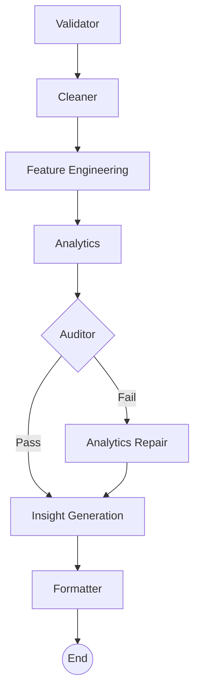

# RetailIQ Agent

RetailIQ Agent is an AI-powered automated data intelligence system designed to process, analyze, and extract insights from raw, noisy e-commerce order datasets. It operates as an autonomous agent utilizing a carefully crafted pipeline built on **LangGraph**. The system automatically handles data validation, cleaning, feature engineering, analytics, insight generation, and formatting to output clean, structured answers to business questions. 

## Features
- **Validation**: Identifies critical issues in the provided raw dataset.
- **Cleaning**: Automatically handles missing values, removes duplicates, and standardizes formats (e.g., currency).
- **Feature Engineering**: Derives new metrics and features for advanced analysis.
- **Analytics Engine**: Calculates key metrics, such as identifying top-performing products, seasonal trends, and high-value customer behaviors.
- **Audit & Repair Loop**: Contains self-auditing steps with fallback mechanisms to ensure high validity of findings.
- **AI-Powered Insights**: Synthesizes business recommendations from quantitative analytics using the LLM.
- **Interactive UI**: A sleek Streamlit dashboard to interactively run the pipeline, explore the data, and review insights.

## Tech Stack
- **Orchestration**: [LangGraph](https://python.langchain.com/docs/langgraph)
- **Data Processing**: Pandas, NumPy
- **LLM/AI Engine**: LangChain Core & Groq API
- **User Interface**: Streamlit
- **Environment Management**: Python-dotenv 

## Architecture Workflow

The analysis process is implemented as a direct acyclic graph (with one conditional fallback edge), progressing through the following nodes:

1. **Validator Node (`validator_node`)**: Scans `raw_df` for missing categories, outlier prices, malformed dates, and logs issues into state.
2. **Cleaner Node (`cleaner_node`)**: Prepares a cleaned dataset. Resolves parsing anomalies and deals with missing or dirty values in the dataset.
3. **Feature Node (`feature_node`)**: Calculates derivative data, e.g., generating Year-Month combinations and parsing order values to float integers to aid further analytics computations.
4. **Analytics Node (`analytics_node`)**: Answers core business queries (e.g., Top 5 Products, Weekly Sales trends, Customer LTV distribution) on the data using Pandas functions.
5. **Auditor Node (`auditor_node`)**: Verifies the outputs of the analytics node. Ensures the answers are coherent and mathematically sound. If the auditor finds inconsistencies, it signals the pipeline to route to a fallback mechanism.
6. **Analytics Repair / Fallback (`analytics_repair_node`)**: Fallback node triggered only if verification fails (`audit_status == "fail"`). Recalculates metrics more robustly.
7. **Insight Node (`insight_node`)**: Feeds the computed analytics to the LLM (via GroqAPI) to formulate a qualitative, strategic business summary answering "What does this mean for the business?".
8. **Formatter Node (`formatter_node`)**: Standardizes the final pipeline output combining both the analytical statistics and generated insights.



## Quickstart

### Prerequisites
- Python 3.9+
- A [Groq API Key](https://console.groq.com/keys)

### Setup
1. Clone the repository and navigate into the `retailiq_agent` directory.
2. Install the necessary dependencies:
   ```bash
   pip install -r requirements.txt
   ```
3. Copy the `.env.example` file and configure your API key:
   ```bash
   cp .env.example .env
   # Add your GROQ_API_KEY inside the .env file.
   ```

### Execution

#### 1. CLI Execution
Run the complete pipeline process via terminal on any compatible `.csv` dataset:
```bash
python main.py <path_to_csv_file> <optional_team_name>
```

**Example:**
```bash
python main.py test_data.csv team-alpha
```
*Results will be saved in the `output/` directory as `output/<team-name>.txt`.*

#### 2. Streamlit Dashboard
Launch the visual web interface to interactively query the dataset and see real-time updates of the LangGraph execution:
```bash
streamlit run streamlit_app.py
```
This will open up a local server dashboard (typically on `http://localhost:8501`) that provides controls to run data analysis and view generated insights dynamically.
