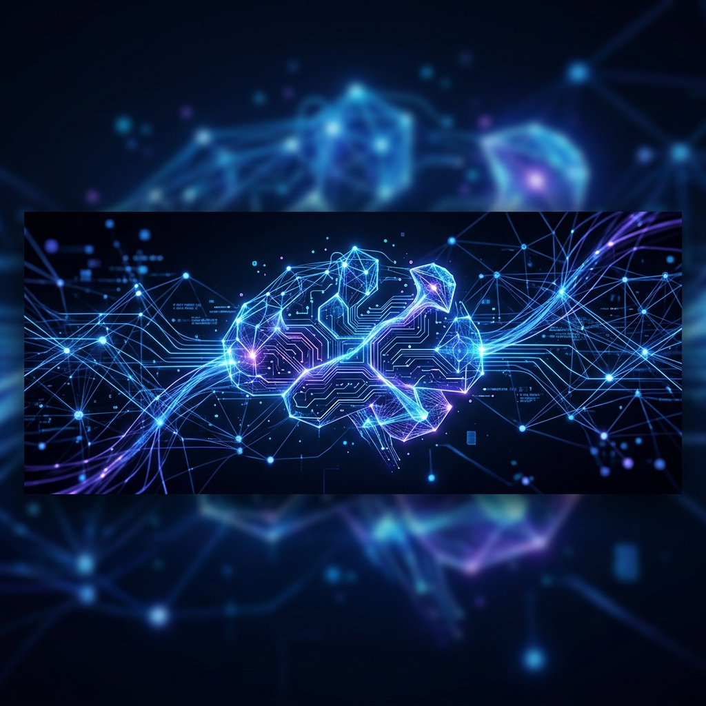
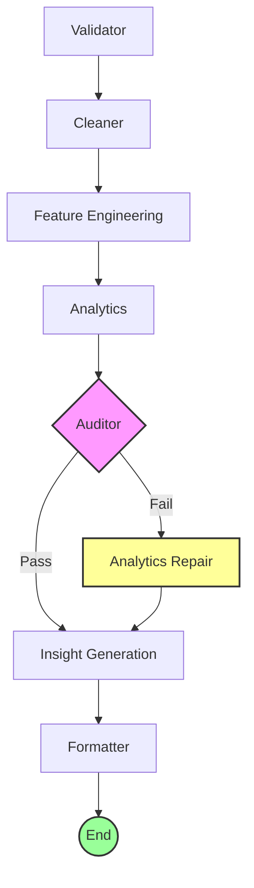

<p align="center">
  
</p>

<h1 align="center">🚀 Agentathon: RetailIQ Intelligence</h1>

<p align="center">
  <strong>The Future of Autonomous Retail Data Intelligence</strong>
</p>

<p align="center">
  
  
  
  
  
</p>

---

## 🌟 Overview

**RetailIQ Agent** is a state-of-the-art AI-powered automated data intelligence system. Built for the modern e-commerce landscape, it processes, cleans, and extracts deep business insights from raw, noisy order datasets. 

Operating as an autonomous agent orchestrated by **LangGraph**, the system manages a sophisticated pipeline from validation and feature engineering to self-auditing and qualitative insight generation.

---

## ✨ Core Features

| Feature | Description |
| :--- | :--- |
| 🛡️ **Autonomous Validation** | Real-time identification of critical data integrity issues. |
| 🧹 **Intelligent Cleaning** | Automated handling of missing values, duplicates, and currency standardization. |
| 📊 **Advanced Analytics** | Deep-dive metrics including seasonal trends and customer LTV distribution. |
| 🛠️ **Feature Engineering** | Dynamic derivation of high-value metrics for business intelligence. |
| 🔄 **Self-Audit Loop** | Integrated verification nodes with automatic fallback repair mechanisms. |
| 💡 **AI Insight Engine** | Generates strategic business recommendations using Groq-powered LLMs. |

---

## 🏗️ Architecture Workflow

The system utilizes a directed acyclic graph (DAG) structure with specialized nodes, ensuring data undergoes rigorous transformation and validation.



---

## 🛠️ Tech Stack

- **Orchestration:** [LangGraph](https://python.langchain.com/docs/langgraph)
- **Intelligence Engine:** LangChain Core & Groq API
- **Data Analysis:** Pandas, NumPy
- **Dashboard:** Streamlit
- **Environment:** Python-dotenv

---

## 🚀 Quick Start

### 1. Prerequisites
- Python 3.9+
- [Groq API Key](https://console.groq.com/keys)

### 2. Installation
```bash
git clone https://github.com/Code-mafia2/agentathon.git
cd agentathon
pip install -r requirements.txt
```

### 3. Environment Setup
Create a `.env` file from the example:
```bash
cp .env.example .env
# Edit .env and add your GROQ_API_KEY
```

### 4. Running the Agent
**CLI Mode:**
```bash
python main.py train_data.csv team-alpha
```

**Dashboard Mode:**
```bash
streamlit run streamlit_app.py
```

---

## 👥 Meet the Team

<table align="center">
  <tr>
    <td align="center">
      <br />
      <sub><b>Akash</b></sub><br />
      🚀 Lead Agent Architect
    </td>
    <td align="center">
      <br />
      <sub><b>Venkatesh</b></sub><br />
      ⚙️ Multi-Agent Engineer
    </td>
    <td align="center">
      <br />
      <sub><b>Samarth</b></sub><br />
      🧠 Agent Logic Specialist
    </td>
    <td align="center">
      <br />
      <sub><b>Rohan</b></sub><br />
      🎨 AI Agent UX/UI Developer
    </td>
  </tr>
</table>

---

<p align="center">
  Built with ❤️ for the Agentathon Challenge
</p>
